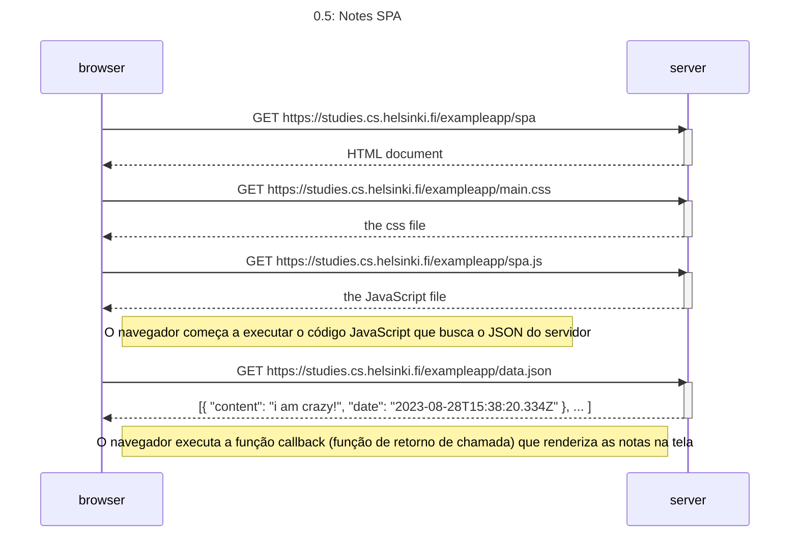

```mermaid
sequenceDiagram
    participant browser
    participant server

    title 0.5: Notes SPA

    browser->>server: GET https://studies.cs.helsinki.fi/exampleapp/spa
    activate server
    server-->>browser: HTML document
    deactivate server

    browser->>server: GET https://studies.cs.helsinki.fi/exampleapp/main.css
    activate server
    server-->>browser: the css file
    deactivate server

    browser->>server: GET https://studies.cs.helsinki.fi/exampleapp/spa.js
    activate server
    server-->>browser: the JavaScript file
    deactivate server

    Note right of browser: O navegador começa a executar o código JavaScript que busca o JSON do servidor

    browser->>server: GET https://studies.cs.helsinki.fi/exampleapp/data.json
    activate server
    server-->>browser: [{ "content": "i am crazy!", "date": "2023-08-28T15:38:20.334Z" }, ... ]
    deactivate server

    Note right of browser: O navegador executa a função callback (função de retorno de chamada) que renderiza as notas na tela
```