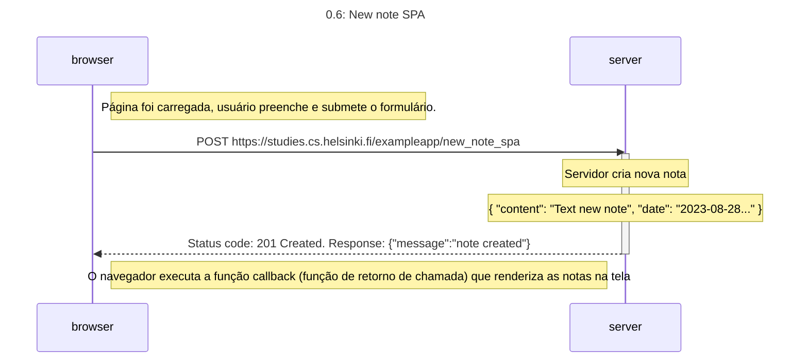

```mermaid
sequenceDiagram
    participant browser
    participant server

    title 0.6: New note SPA

    Note right of browser: Página foi carregada, usuário preenche e submete o formulário.

    browser->>server: POST https://studies.cs.helsinki.fi/exampleapp/new_note_spa
    activate server
    Note over server: Servidor cria nova nota
    Note over server: { "content": "Text new note", "date": "2023-08-28..." }
    server-->>browser: Status code: 201 Created. Response: {"message":"note created"}
    deactivate server
    
    Note right of browser: O navegador executa a função callback (função de retorno de chamada) que renderiza as notas na tela
```